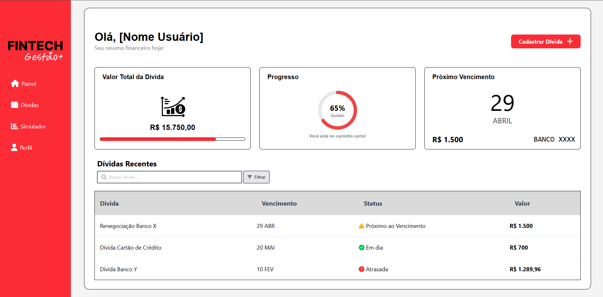

# 💰 Fintech Gestão+

Dashboard financeiro pessoal para controle e gerenciamento de dívidas.

## 📸 Preview

## 🚀 Tecnologias utilizadas

- HTML5
- Tailwind CSS v4
- Font Awesome 6

## 📋 Funcionalidades

- [x] Dashboard com resumo financeiro
- [x] Card de valor total de dívidas
- [x] Gráfico de progresso (% quitado)
- [x] Próximo vencimento
- [x] Tabela de dívidas recentes com status
- [x] Barra de pesquisa com filtro
- [x] Layout responsivo (mobile + desktop)
- [x] Menu de navegação mobile

## 🎨 Layout

O projeto foi desenvolvido com base em um mockup profissional,
reproduzindo fielmente o design original utilizando apenas
HTML e Tailwind CSS, sem frameworks JavaScript.

## 📁 Estrutura do projeto

 fintech-gestao/
    ├── src/
    │   └── input.css
    ├── dist/
    │   ├── css/
    │   │   └── styles.css
    │   └── image/
    ├── index.html
    └── package.json

## 👨‍💻 Autor

Victor Nepomuceno